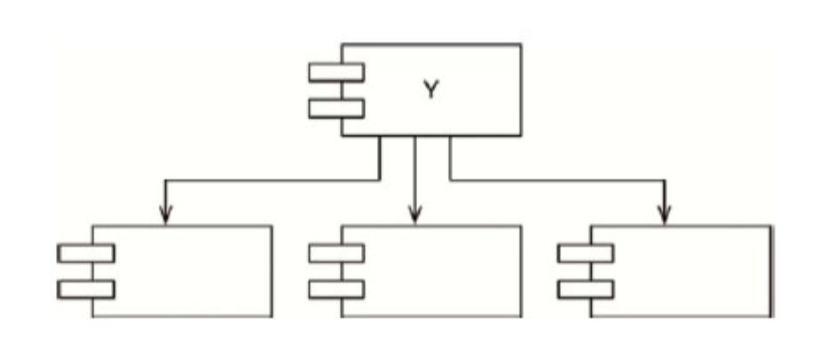

# 架构整洁之道

## 13.组件聚合

这一章主要讨论的是，什么类可以被组合成一个组件。主要涉及到三个与构建组件相关的基本原则。

- REP：复用/发布等同原则。
- CCP：共同闭包原则。
- CRP：共同复用原则。

### REP 复用/发布等同原则

**软件复用的最小粒度应等同于其发布的最小粒度**。毕竟如果想要复用某个软件组件的话，一般就必须要求该组件的开发由某种发布流程来驱动，并且有明确的发布版本号。软件开发者必须要能够知道这些组件的发布时间，以及每次发布带来了哪些变更。

从软件设计和架构设计的角度来看，REP原则就是指组件中的类与模块必须是**彼此紧密相关**的。也就是说，一个组件不能由一组毫无关联的类和模块组成，它们之间应该有一个共同的主题或者大方向。并且，根据该原则，一个组件中包含的类与模块还应该是**可以同时发布**的。这意味着它们共享相同的版本号与版本跟踪，并且包含在相同的发行文档中，这些都应该同时对该组件的作者和用户有意义。

该建议薄弱的原因是它没有清晰地定义出到底应该如何将类与模块组合成组件，需要通过CCP及CRP原则进行补充。

### CCP 共同闭包原则

CCP的主要作用就是提示我们要将所有可能会被一起修改的类集中在一处。

我们应该将那些会同时修改，并且为相同目的而修改的类放到同一个组件中，而将不会同时修改，并且不会为了相同目的而修改的那些类放到不同的组件中。这其实是SRP原则在组件层面上的再度阐述。在SRP原则的指导下，我们将会把变更原因不同的函数放入不同的类中。而CCP原则指导我们应该将变更原因不同的类放入不同的组件中。

### CRP 共同复用原则

共同复用原则（CRP）是另外一个帮助我们决策类和模块归属于哪一个组件的原则。该原则建议我们将经常共同复用的类和模块放在同一个组件中，**不是紧密相连的类不应该被放在同一个组件里**。

通常情况下，类很少会被单独复用。更常见的情况是多个类同时作为某个可复用的抽象定义被共同复用。CRP原则指导我们将这些类放在同一个组件中，而在这样的组件中，我们应该预见到会存在着许多互相依赖的类。因此，当我们决定要依赖某个组件时，最好是实际需要依赖该组件中的每个类。换句话说，我们希望组件中的所有类是不能拆分的，即不应该出现别人只需要依赖它的某几个类而不需要其他类的情况。

CRP原则实际上是ISP原则的一个普适版。ISP原则是建议我们不要依赖带有不需要的函数的类，而CRP原则则是建议我们不要依赖带有不需要的类的组件。

### 组件聚合张力图

上述三个原则之间彼此存在着竞争关系。REP和CCP原则是黏合性原则，它们会让组件变得更大，而CRP原则是排除性原则，它会尽量让组件变小。软件架构师的任务就是要在这三个原则中间进行取舍。

只关注REP和CRP的软件架构师会发现，即使是简单的变更也会同时影响到许多组件。相反，如果软件架构师过于关注CCP和REP，则会导致很多不必要的发布。

## 14.组件耦合

讨论的三条原则主要关注的是组件之间的关系。在这些原则中，我们同样会面临着研发能力和逻辑设计之间的冲突。

- ADP 无依赖环原则
- SDP 稳定依赖原则
- SAP 稳定抽象原则

### ADP 无依赖环原则

组件依赖关系图中不应该出现环。

这个原则出现的原因是因为多个程序员修改了同一份源代码文件，每个人都在不停的修改自己的代码来适应其他人所提交的变更。

在过去几十年中，针对这个问题逐渐演化出了两种解决方案。第一种是“**每周构建**”，第二种是“**无依赖环原则（ADP）**”。

**每周构建**方案是中型项目中很常见的一种管理手段。其具体做法如下：在每周的前四天中，让所有的程序员在自己的私有库上工作，忽略其他人的修改，也不考虑互相之间的集成问题；然后在每周五要求所有人将自己所做的变更提交，进行统一构建。但是这样项目的质量和风险无法保障。

**无依赖环**原则则是将研发项目划分为一些可单独发布的组件，这些组件可以交由单人或者某一组程序员来独立完成。当有人或团队完成某个组件的某个版本时，他们就会通过发布机制通知其他程序员，并给该组件打一个版本号，放入一个共享目录。这样一来，每个人都可以依赖于这些组件公开发布的版本来进行开发，而组件开发者则可以继续去修改自己的私有版本。

**打破循环依赖的方法**

1. 应用依赖反转原则（DIP）：将依赖方需要的被依赖方的接口抽取出来，让被依赖方转而去依赖依赖方。
2. 创建一个新的组件：让原有的依赖方和被依赖方都去依赖于这个新组件。

事实上，组件依赖结构图并不是用来描述应用程序功能的，它更像是应用程序在构建性与维护性方面的一张地图。这就是组件的依赖结构图不能在项目的开始阶段被设计出来的原因——当时该项目还没有任何被构建和维护的需要，自然也就不需要一张地图来指引。

### SDP 稳定依赖原则

依赖关系必须要指向更稳定的方向。设计这件事不可能是完全静止的，如果我们要让一个设计是可维护的，那么其中某些部分就必须是可变的。通过遵守共同闭包原则（CCP），我们可以创造出对某些变更敏感，对其他变更不敏感的组件。这其中的一些组件在设计上就已经是考虑了易变性，预期它们会经常发生变更的。任何一个我们预期会经常变更的组件都不应该被一个难于修改的组件所依赖，否则这个多变的组件也将会变得非常难以被修改。

**稳定性指标**

究竟该如何来量化一个组件的稳定性呢？

其中一种方法是计算所有入和出的依赖关系。通过这种方法，我们就可以计算出一个组件的位置稳定性（positional stability）。

- Fan-in：入向依赖，这个指标指代了组件外部类依赖于组件内部类的数量。
- Fan-out：出向依赖，这个指标指代了组件内部类依赖于组件外部类的数量。
- I：不稳定性，I=Fan-out/（Fan-in+Fan-out）。该指标的范围是[0,1],I=0意味着组件是最稳定的，I=1意味着组件是最不稳定的。

以图为例，下面是最稳定的组件

下面是最不稳定的组件

### SAP 稳定抽象原则

在一个软件系统中，高阶架构设计及策略相关的高阶决策这一类的组件不应该经常发生变更，应该被放到稳定组件中。但是如果放到稳定组件中，那么用于描述那些策略的源代码就很难被修改了，如何才能让一个无限稳定的组件接受变更呢？

开闭原则（OCP）为我们提供了答案。这个原则告诉我们：**创造一个足够灵活、能够被扩展，而且不需要修改的类是可能的，而这正是我们所需要的**。哪一种类符合这个原则呢？答案是**抽象类**。

稳定抽象原则（SAP）为组件的稳定性与它的抽象化程度建立了一种关联。一方面，该原则要求稳定的组件同时应该是抽象的，这样它的稳定性就不会影响到扩展性。另一方面，该原则也要求一个不稳定的组件应该包含具体的实现代码，这样它的不稳定性就可以通过具体的代码被轻易修改。因此，如果一个组件想要成为稳定组件，那么它就应该由接口和抽象类组成，以便将来做扩展。

将SAP与SDP这两个原则结合起来，就等于组件层次上的DIP。

**衡量抽象化程度**

A指标是对组件抽象化程度的一个衡量，它的值是组件中抽象类与接口所占的比例。那么：

- Nc：组件中类的数量。
- Na：组件中抽象类和接口的数量。
- A：抽象程度，A=Na÷Nc。

A指标的取值范围是从0到1，值为0代表组件中没有任何抽象类，值为1就意味着组件中只有抽象类。

### 主序列

现在，我们可以来定义组件的稳定性I与其抽象化程度A之间的关系了，具体如图14.12所示。在该图中，纵轴为A值，横轴为I值。如果我们将两个“设计良好”的组件绘制在该图上，那么最稳定的、包含了无限抽象类的组件应该位于左上角（0,1），最不稳定的、最具体的组件应该位于右下角（1,0）。

痛苦区：这样的组件在设计上是不佳的，因为它很难被修改，这意味着该组件不能被扩展。这样一来，因为这个组件不是抽象的，而且它又由于稳定性的原因变得特别难以被修改，我们并不希望一个设计良好的组件贴近这个区域。但是一些软件组件确实处在这个区域中，如数据库表结构，工具类库如string等。

无用区：大量的抽象，但是又没什么组件依赖他。

坐落在主序列上的组件不会为了追求稳定性而被设计得“太过抽象”，也不会为了避免抽象化而被设计得“太过不稳定”。这样的组件既不会特别难以被修改，又可以实现足够的功能。

## 15.什么是软件架构

软件架构师自身需要是程序员，并且必须一直坚持做一线程序员。

软件系统的架构质量是由它的构建者所决定的，软件架构这项工作的实质就是规划如何将系统切分成组件，并安排好组件之间的排列关系，以及组件之间互相通信的方式。软件架构设计的主要目标是支撑软件系统的全生命周期，设计良好的架构可以让系统便于理解、易于修改、方便维护，并且能轻松部署。软件架构的终极目标就是最大化程序员的生产力，同时最小化系统的总运营成本。

如果想设计一个便于推进各项工作的系统，其策略就是要在**设计中尽可能长时间地保留尽可能多的可选项**。软件架构师的目标是创建一种系统形态，该形态会以**策略**为最基本的元素，并让**细节**与**策略**脱离关系，以允许在具体决策过程中推迟或延迟与细节相关的内容。

## 16.独立性

一个设计良好的软件架构必须支持以下几点:

- 系统的用例与正常运行。
- 系统的维护。
- 系统的开发。
- 系统的部署。

### 用例

软件的架构必须为其用例提供支持。一个设计良好的架构在行为上对系统最重要的作用就是明确和显式地反映系统设计意图的行为，使其在架构层面上可见。开发人员将不需要在系统中查找系统所应有的行为，因为这些行为在系统顶层作为主要元素已经是明确可见的了。

### 运行

架构在支持系统运行方面扮演着更实际的角色。如果某个系统每秒要处理100000个用户，该系统的架构就必须能支持这种级别的吞吐量和响应时间。同样的，如果某个系统要在毫秒级的时间内完成对大数据仓库的查询，那么该系统的架构也必须能支持这类操作。

如果该系统的架构能够在其组件之间做一些适当的隔离，同时不强制规定组件之间的交互方式，该系统就可以随时根据不断变化的运行需求来转换成各种运行时的线程、进程或服务模型。

### 开发

系统的架构在支持开发环境方面当然扮演着重要的角色，我们在这里可以引述一下康威定律：

> 任何一个组织在设计系统时，往往都会复制出一个与该组织内沟通结构相同的系统。

一个由多个不同目标的团队协作开发的系统必须具有相应的软件架构。

### 按层解耦

从用例的角度来看，架构师的目标是让系统结构支持其所需要的所有用例。但是问题恰恰是我们无法预知全部的用例。好在架构师应该还是知道整个系统的基本设计意图的。所以架构师可以通过采用单一职责原则（SRP）和共同闭包原则（CCP），以及既定的系统设计意图来隔离那些变更原因不同的部分，集成变更原因相同的部分。

通过区分不同的变更原因，我们将一个系统可以被解耦成若干个水平分层——UI界面、应用独有的业务逻辑、领域普适的业务逻辑、数据库等基础组件层等。

### 用例的解耦

还有什么不同原因的变更呢？答案正是这些用例本身！

如果我们按照变更原因的不同对系统进行解耦，就可以持续地向系统内添加新的用例，而不会影响旧有的用例。

## 17.划分边界

软件架构设计本身就是一门划分边界的艺术。边界的作用是将软件分割成各种元素，以便约束边界两侧之间的依赖关系。其中有一些边界是在项目初期——甚至在编写代码之前——就已经划分好，而其他的边界则是后来才划分的。在项目初期划分这些边界的目的是方便我们尽量将一些决策延后进行，并且确保未来这些决策不会对系统的核心业务逻辑产生干扰。

通过划清边界，我们可以推迟和延后一些细节性的决策，这最终会为我们节省大量的时间、避免大量的问题。

边界有多种：

- 源码维度的边界
- 部署层次的边界，如java的jar文件，net的dll等
- 服务层次

## 19.策略与层次

本质上，所有的软件系统都是一组策略语句的集合。软件架构设计的工作重点之一就是，将这些策略彼此分离，然后将它们按照变更的方式进行重新分组。其中变更原因、时间和层次相同的策略应该被分到同一个组件中。反之，变更原因、时间和层次不同的策略则应该分属于不同的组件。

### 层次

我们对“层次”是严格按照“输入与输出之间的距离”来定义的。也就是说，一条策略距离系统的输入/输出越远，它所属的层次就越高。而直接管理输入/输出的策略在系统中的层次是最低的。

一般来说，低层组件被设计为依赖于高层组件。通过将策略隔离，并让源码中的依赖方向都统一调整为指向高层策略，我们可以大幅度降低系统变更所带来的影响。因为一些针对系统低层组件的紧急小修改几乎不会影响系统中更高级、更重要的组件。

## 20.业务逻辑

如果我们要将自己的应用程序划分为业务逻辑和插件两部分，就必须更仔细地了解业务逻辑究竟是什么，它到底有几种类型。

严格地讲，业务逻辑就是程序中那些真正用于赚钱或省钱的业务逻辑与过程。我们通常称这些逻辑为“**关键业务逻辑**”，因为它们是一项业务的关键部分，不管有没有自动化系统来执行这项业务，这一点是不会改变的。

这些业务逻辑应该保持纯净，不要掺杂用户界面或者所使用的数据库相关的东西。在理想情况下，这部分代表业务逻辑的代码应该是整个系统的核心，其他低层概念的实现应该以插件形式接入系统中。业务逻辑应该是系统中最独立、复用性最高的代码。

### 业务实体

**关键业务逻辑**和**关键业务数据**是紧密相关的，所以它们很适合被放在同一个对象中处理。我们将这种对象称为“**业务实体（Entity）**”。

业务实体实际上就是计算机系统中的一种对象，这种对象中包含了一系列用于操作关键数据的业务逻辑。这些实体对象要么直接包含关键业务数据，要么可以很容易地访问这些数据。业务实体的接口层则是由那些实现关键业务逻辑、操作关键业务数据的函数组成的。

### 用例

用例本质上就是关于如何操作一个自动化系统的描述，它定义了用户需要提供的输入数据、用户应该得到的输出信息以及产生输出所应该采取的处理步骤。当然，用例所描述的是某种特定应用情景下的业务逻辑，它并非业务实体中所包含的关键业务逻辑。

用例并不描述系统与用户之间的接口，它只描述该应用在某些特定情景下的业务逻辑，这些业务逻辑所规范的是用户与业务实体之间的交互方式，它与数据流入/流出系统的方式无关。

### 请求与响应模型

在通常情况下，用例会接收输入数据，并产生输出数据。但在一个设计良好的架构中，用例对象通常不应该知道数据展现给用户或者其他组件的方式。因此，用例类所接收的输入应该是一个简单的请求性数据结构，而返回输出的应该是一个简单的响应性数据结构。

## 21.尖叫的软件架构

**架构设计的核心目标**

一个良好的架构设计应该围绕着用例来展开，这样的架构设计可以在脱离框架、工具以及使用环境的情况下完整地描述用例。而且，良好的架构设计应该尽可能地允许用户推迟和延后决定采用什么框架、数据库、Web服务以及其他与环境相关的工具。

如果系统架构的所有设计都是围绕着用例来展开的，并且在使用框架的问题上保持谨慎的态度，那么我们就应该可以在不依赖任何框架的情况下针对这些用例进行单元测试。

## 22.整洁架构

在过去的几十年中，我们曾见证过一系列关于系统架构的想法被提出，例如六边形架构、DCI架构、BCE架构等，这些架构都具有同一个设计目标：按照不同关注点对软件进行切割。这些架构设计出来的系统都具有以下特点：

- 独立于框架
- 可被测试
- 独立于UI
- 独立于数据库
- 独立于任何外部机构

**依赖关系规则**

同心圆分别代表了软件系统中的不同层次，通常越靠近中心，其所在的软件层次就越高。基本上，外层圆代表的是机制，内层圆代表的是策略。

它的依赖关系规则：源码中的依赖关系必须只指向同心圆的内层，即**由低层机制指向高层策略**。

**业务实体**

业务实体这一层中封装的是整个系统的关键业务逻辑，一个业务实体既可以是一个带有方法的对象，也可以是一组数据结构和函数的集合。无论如何，只要它能被系统中的其他不同应用复用就可以。

**用例**

软件的用例层中通常包含的是特定应用场景下的业务逻辑，这里面封装并实现了整个系统的所有用例。这些用例引导了数据在业务实体之间的流入/流出，并指挥着业务实体利用其中的关键业务逻辑来实现用例的设计目标。

**接口适配器**

软件的接口适配器层中通常是一组数据转换器，它们负责将数据从对用例和业务实体而言最方便操作的格式，转化成外部系统（譬如数据库以及Web）最方便操作的格式。

**框架与驱动程序**

框架与驱动程序层中包含了所有的实现细节。Web是一个实现细节，数据库也是一个实现细节。我们将这些细节放在最外层，这样它们就很难影响到其他层了。

## 23.展示器和谦卑对象

展示器Presenter是采用谦卑对象模式（humble object）的一种形式，这种设计模式可以很好的帮助识别和保护系统架构的边界。

谦卑对象模式最初的设计目的是帮助单元测试的编写者区分容易测试的行为与难以测试的行为，并将它们隔离。其设计思路非常简单，就是将这两类行为拆分成两组模块或类。其中一组模块被称为谦卑（Humble）组，包含了系统中所有难以测试的行为，而这些行为已经被简化到不能再简化了。另一组模块则包含了所有不属于谦卑对象的行为。例如

- GUI通常是很难进行单元测试的，但是GUI中的大部分行为是很容易被测试的，这时候就可以利用谦卑对象模式将GUI的这两种行为拆分成展示器和视图两部分。
- 数据库网关是用例交互器与数据库的一种谦卑对象模式的实现，数据库逻辑是谦卑对象

使用谦卑对象模式，能帮我们构建更容易测试的架构。

## 27.服务：宏观与微观

首先，我们来批判“只要使用了服务，就等于有了一套架构”这种思想。这显然是完全错误的。如前文所述，架构设计的任务就是找到高层策略与低层细节之间的架构边界，同时保证这些边界遵守依赖关系规则。所谓的服务本身只是一种比函数调用方式成本稍高的，分割应用程序行为的一种形式，与系统架构无关。

很多人认为将系统拆分成服务的一个最重要的好处就是让每个服务之间实现强解耦，但是事实上，如果给服务之间传递的数据记录中增加了一个新字段，那么每个需要操作这个字段的服务都必须要做出相应的变更，服务之间必须对这条数据的解读达成一致。因此其实这些服务全部是强耦合于这条数据结构的，因此他们是间接彼此耦合的。

人们认为的另一个使用服务的好处就是，不同的服务可以由不同的专门团队负责和运维。这让开发团队可以采用dev-ops混合的形式来编写、维护以及运维各自的服务，这种开发和部署上的独立性被认为是可扩展的。这个有一定道理，但是大型系统一样可以采用单体模式，或者组件模式来构建。

系统的架构边界事实上并不落在服务之间，而是穿透所有服务，在服务内部以组件的形式存在。**为了处理这个所有大型系统都会遇到的横跨型变更问题，我们必须在服务内部采用遵守依赖关系原则的组件设计方式。**总而言之，服务边界并不能代表系统的架构边界，服务内部的组件边界才是。
